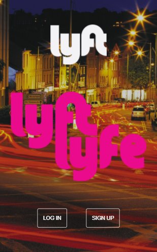
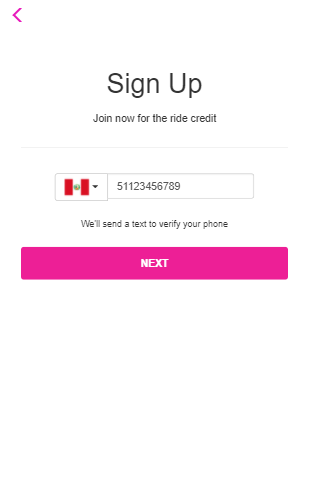
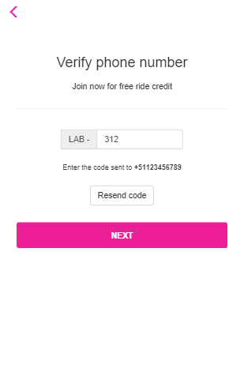
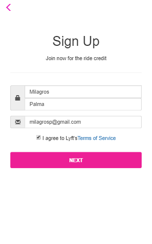
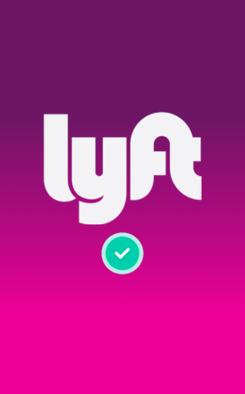

# Lyft App
## Descripción
El repositorio contiene una web-app que replica el sitio de Lyft. El reto consiste en cumplir los pasos necesarios para que el usuario pueda registrarse.

## Herramientas
+ HTML5
+ CSS3
+ jQuery
+ Bootstrap

## Flujo de la aplicación
1. Splash: `index.html`
2. Vista principal: `home.html`
3. Sign Up (solicita número de teléfono): `sign-up.html`
4. Verify your number (solicita código): `verify.html`
5. Sign Up (solicita nombre, apellido y correo): `register.html`
6. Vista final: `close.html`

## Producto final
+ #### Splash

+ #### Home

+ #### Sign Up (teléfono)

+ #### Verify

+ #### Sign Up (datos personales)

+ #### Validated

